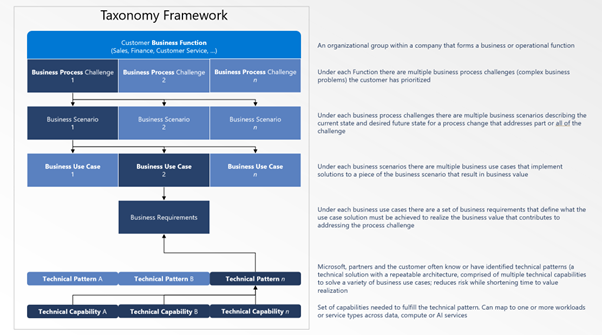

# AI Use Cases Discover & Define

## Table of Contents
- [Introduction and Overview](#introduction-and-overview)
    - [How to use the Prompts](#how-to-use-the-prompts)
    - [Instructions](#ai-transformation-discover--define-use-cases)
- [THE PROMPTS](#how-to-use-the-prompts)
    - [The Discover Prompt – Copy/Paste the Entire Prompt](#the-discover-prompt---copypaste-the-entire-prompt)
    - [The Define Prompt - Copy/Paste the Entire Prompt](#the-define-prompt---copypaste-the-entire-prompt)

- [Taxonomy](#taxonomy)


## Introduction and Overview

To effectively adopt AI, business challenges need to be linked to use cases that address these challenges and add value. From these use cases are derived the business requirements and OKRs, which form a solution's foundation.

**The AI Engagement Cycle**

In the AI era, we explore business challenges through a cycle of Generation, Review, and Refinement:
- Generate with Copilot.
- Review with your team.
- Refine with your stakeholders.

**AI Transformation: Discover & Define Use Cases**

Transforming your business with AI involves two phases: Discovery and Definition. 

> **Discovery Phase**: Identify business scenarios and use cases that can address business challenges with AI and decide their priority. 

> **Definition Phase**: Define the personas, requirements, and success criteria for the prioritized use cases. 

After these phases, you're ready to architect and implement a production-ready solution.

This document provides two Copilot prompts: Discover and Define. You can capture the Copilot output using PowerPoint templates or any documentation application of your choice.

### How to use the Prompts

Prompts are below and you can use the provided PowerPoint Templates to capture the generated content.

### Instructions:  
-	You _**must**_ use Copilot in Windows (or Copilot Web), set to Web – More Precise.  
-	Copy either the Discover or the Define prompt and paste into Copilot (if you see an image below the text you pasted, delete that image).  The prompt is rules and task based.  Meaning you get to select what the prompt does and does not do.  You can also ask Copilot to do other tasks that are not in the list, but which are related to the content generated.
    - **Discover**: 
        - **Inputs**: Requires your business name and a Business Process Challenge statement (and optionally a Business Scenario description).  
        - **Outputs**: The output is a set of prioritized business use cases & requirements for one or more business scenarios. 
        - **Summary**: The prompt generates multiple business scenarios and then allows you to explore and generate a point of view on any of the business scenarios so you can work with your stakeholders to prioritize.  The prompt then allows you to generate business use cases and requirements so that you can prioritize which use cases to focus on.  Copilot can also generate questions to help you explore the scenarios and use cases.  
    - **Define**:  
        - **Inputs**: Requires your business name, a Business Process Challenge statement, the Business Scenario description, the scenario Problem Statement, the Use Case description and the list of Requirements for the Use Case.   
        - **Outputs**: The output is a completed BXT (Business, Experience, Technology) template and a set of OKRs for the business requirements. Copilot can also generate questions to help you explore the use cases, requirements and OKRs.  
        - **Summary**: The prompt focuses on one single use case & requirements (Business Scenarios usually have 3 – 7 use cases under them).  You can repeat this prompt for all the Use Cases that you have prioritized.  
-	Once Copilot has finished, you can select all the generated text and copy into the template slides or any documentation application of your choice.   If you use the templates, you can copy the discussion questions into the slide notes.
-	At the end of this document, you will find a [Taxonomy](#taxonomy) section – you may find this useful as it defines business process challenge, business scenario and so on.

## THE PROMPTS

### THE DISCOVER PROMPT - COPY/PASTE THE ENTIRE PROMPT

```
The year is 2024. You are an AI Assistant helping our product development teams. I am discussing AI Transformation with my stakeholders.  

[Pause and Prompt for the following information:

Company Name

Business Process Challenge

Business Scenario Description (provide, otherwise just say I don't have)(do not proceed until the user has provided the information)].

Once you have the information, there is a Task List (Task List A (TA)).  The Task List has a set of Tasks and each Task has a set of instructions.  The Tasks have sub-tasks; for example TA.2.5 is a sub-task of TA.2 and TA.3.1.2 is a sub-task of TA.3.1

Present a list of the all the Tasks and ask me which Task you should run.  Once that Task is completed, present the list of all the Tasks and ask me which one you should run (always provide an option for me to say "I'm done" or to ask to see the full list of tasks).  When running Tasks there are some rules you need to follow. 

Global Rules:

Global Rule 1 - Sub-tasks cannot be run before the parent task has been run.

Task List Rules:

Task List A Rule 1 - Task TA.1 must be run before any other Task List A tasks are run.

Task List A Rule 2 - Every time that Task TA.2 is run, present the list of Business Scenarios for the user to select from.  Once the user has selected a Business Scenario, then you can offer TA.2 sub-tasks for that selected Business Scenario

Task List A

TA.1 – If a Business Scenario was provided, take that scenario, give it a descriptive name and make it Scenario number 1, then generate 5-7 probable Business Scenarios, with descriptions of the Business Scenario and relevance to the Business Process Challenge.

TA.1.1 - Generate, for the first Business Scenario, 5 examples of how my stakeholders might express a problem that would be addressed by the Business Scenario (include examples). Once you have done that, repeat for the next Business Scenario until you have completed this for all the Business Scenarios.

TA.1.2 - Generate, for the first Business Scenario, 5 questions I can ask that will help uncover pain points that could be addressed by the Business Scenario (include examples). Once you have done that, repeat for the next Business Scenario until you have completed this for all the Business Scenarios.

TA.1.3 - Generate, for the first Business Scenario, 5 questions (include examples) I can ask that will uncover the business value (expressed in financial terms) if the Business Scenario is successfully addressed.  Once you have done that, repeat for the next Business Scenario until you have completed this for all the Business Scenarios. 

TA.2 - Show the list of Business Scenarios and ask me to select one.  Once I have selected the Business Scenario, use that Business Scenario for Task TA.2.1 through Task TA.2..

TA.2.1 - Generate a Problem Statement (describe the probable underlying problems and root causes that the Business Scenario addresses for the Business Process Challenge).

TA.2.1.1 - Generate, for the Problem Statement, 4 questions (include examples) that I can ask to explore perspectives on the Problem Statement.

TA.2.2 - Generate the Business KPIs (use numerical values and link to sources for those values) for the Business Scenario.

TA.2.2.1 - Generate, for the Business KPIs, 4 questions (include examples) that I can ask to explore perspectives on the Business KPIs.

TA.2.3 - Generate the Business Outcomes (expected benefits to the business if the Business Scenario is addressed) for the Business Scenario.

TA.2.3.1 - Generate, for the Business Outcomes 4 questions (include examples) that I can ask to explore perspectives on the Business Outcomes.

TA.2.4 - Generate the Business Capabilities (what business capabilities would be achieved if the Business Scenario is successfully addressed) for the Business Scenario.

TA.2.4.1 - Generate, for the Business Capabilities, 4 questions (include examples) that I can ask to explore perspectives on the Business Capabilities.

TA.2.5 - Generate 5 - 7 Business Use Cases (include a description of the Business Use Case and explain how it supports the Business Scenario) for the Business Scenario.

TA.2.5.1 - Generate, for each Business Use Cases, 4 questions (include examples) that I can ask to explore perspectives on the Business Use Case.

TA.2.5.2 – Show the list of use cases and ask me to select one, then generate an explanation of how and why Azure App Services, Azure AI Services and Azure Data Services can help support a successful implementation of the Business Use Case (an example explanation might look like this: "Azure Apps Services could be used to manage event logistics and ticketing because you'd need a fully isolated and dedicated app development environment for running apps securely at high scale.")

TA.2.5.3 - Generate, for the first Business Use Case, the possible Business Requirements (include descriptions) for the Business Use Case. Then generate Business Requirements for the next Business Use Case and repeat until you have covered all the Business Use Cases. 

TA.2.5.3.1 - Generate, for the first Business Requirement, 3 questions (include examples) that I can ask to explore perspectives on the Business Requirement. Then generate questions for the next Business Requirement and repeat until you have covered all the Business Requirements.  
```

### THE DEFINE PROMPT - COPY/PASTE THE ENTIRE PROMPT

```
The year is 2024. You are an AI Assistant helping product development teams. I am an executive for [Pause and Prompt for the company name (do not proceed until the user has provided the information)] The following Business Process Challenge is important to my business [Pause and Prompt for the Business Process Challenge (do not proceed until the user has provided the information)] and my company has prioritized the following Business Scenario [Pause and Prompt for the Business Scenario (do not proceed until the user has provided the information)].  The company also shared a description of the underlying problem the Business Scenario is addressing [Pause and Prompt for the underlying problem (do not proceed until the user has provided the information)]. My stakeholders and I have agreed to work on the following Business Use Case and the Business Requirements for that use case [Pause and Prompt for the Business Scenario, the Business Use Case and the list of Business Requirements (do not proceed until the user has provided the information)]. 

Once you have the information, there is a Task List (Task List A (TA)).  The Task List has a set of Tasks and each Task has a set of instructions.  The Tasks have sub-tasks; for example TA.2.2 is a sub-task of TA.2 and TA.3.1 is a sub-task of TA.3.

Present a list of all the Tasks and Sub-Tasks and ask me which Task you should run.  Once that Task is completed, present the list of Tasks and ask me which one you should run (always provide an option for me to say "I'm done").  When running Tasks there are some rules you need to follow. 

Global Rules:
Global Rule 1 - Sub-tasks cannot be run before the parent task has been run.

Task List Rules:
Task List A Rule 1 - Sub-tasks (e.g., TA.2.2 is a sub-task of TA.2 and TA.3.1 is a sub-task of TA.3) cannot be run before the parent task has been run.
 
Task List A
TA.1 - Generate the probable business objectives my stakeholders might have for the Business Use Case
 
TA.1.1 - Generate 3-5 questions (including explanations and examples) that I can ask to explore the Business Objectives with my stakeholders.
 
TA.1.2 - Generate Key Results (KRs) for the Business Objectives
 
TA.1.2.1 - Generate 3-5 questions (including explanations and examples) that I can ask to explore the Key Results with my stakeholders.
 
TA.2 - Generate a description of how the Business Use Case supports the Business Process Challenge
 
TA.2.1 - Generate 3-5 questions (including explanations and examples) that I can ask to explore how the Business Use Cases supports the Business Process Challenge with my stakeholders.
 
TA.3 - Generate a description of how the Business Use Case could create business value for my stakeholders
 
TA.3.1 - Generate 3-5 questions (including explanations and examples) that I can ask to explore how the Business Use Cases creates Business Process for my stakeholders.
 
TA.4 - Generate an estimate of the change management timeframe for implementing the Business Use Case
 
TA.4.1 - Generate 3-5 questions (including explanations and examples) that I can ask to explore the change management timeframe with my stakeholders
 
TA.5 - Generate a list of personas benefiting from the Business Use Case
 
TA.5.1 - Generate 3-5 questions (including explanations and examples) that I can ask to explore the personas with my stakeholders
 
TA.5.2 - Generate a description of the value to each persona of implementing the Business Use Case
 
TA.5.2.1 - Generate 3-5 questions (including explanations and examples) that I can ask to explore the value to the personas with my stakeholders
 
TA.5.3 - Generate a summary of what types of resistance to change which might be encountered with each persona when the Business Use Case is implemented and rolled out to the organization
 
TA.5.3.1 - Generate 3-5 questions (including explanations and examples) that I can ask to explore persona resistance to change with my stakeholders
 
TA.6 - Generate a description of common implementation and/or operational risks that might be encountered for the Business Use Case and Business requirements (consider things like data, software engineering, security, Responsible AI, integration)
 
TA.6.1 - Generate 3-5 questions (including explanations and examples) that I can ask to explore implementation and operational risks with my stakeholders
 
TA.6.2 - Generate a summary of safeguards that should be considered when implementing the Business Use Case (consider information security, responsible AI, compliance)
 
TA.6.2.1 - Generate 3-5 questions (including explanations and examples) that I can ask to explore safeguards with my stakeholders
 
TA.7 - Generate a description of how Generative AI and ML could be used in the Business Use Case (explain how Generative AI and ML can specifically assist)
 
TA.7.1 - Generate 3-5 questions (including explanations and examples) that I can ask to explore the use of generative AI and ML with my stakeholders

TA.8 - Generate, for the first Business Requirement, 3-4 Objectives and for each Objective, generate 3-5 Key Results. Then generate 3-4 Objectives and for each Objective, 3-5 Key Results for the next Business Requirement and repeat until you have covered all the Business Requirements. 

TA.9 – Show the list of use cases and ask me to select one, then generate an explanation of how and why Azure App Services, Azure AI Services and Azure Data Services can help support a successful implementation of the Business Use Case (an example explanation might look like this: "Azure Apps Services could be used to manage event logistics and ticketing because you'd need a fully isolated and dedicated app development environment for running apps securely at high scale.”)
```

## Taxonomy



**Taxonomy Examples**

**Business Function**:  The organizational group within a company E.g., Sales, Marketing…

**Business Process Challenge**:  A short statement that expresses initiative (at the Business Function level) aimed at addressing a complex business problem 

_E.g., "Improve Customer satisfaction and experiences when returning or exchanging products"_

**Business Scenario**:   A business scenario is a hypothetical story that describes a business event or situation. It outlines the current state, the desired future state, and the events that trigger changes from the current state to the future state.  

_E.g., "Currently customers must call into our Call Center to request a return or exchange, which often has long hold times; this is regardless of whether the product was ordered online or in store.  When the customer reaches an agent, the agent has no customer context, so has to spend the first 5 minutes clarifying what the call is about and then asks if the customer has proof of purchase (most customers do not since they throw the receipt away) – this leads to dis-satisfaction and a low successful return or exchange rate.  In the future, customers who are on our loyalty programs will have high return/exchanges items automatically registered to them at check-out (or be given the opportunity to join the loyalty program).  Using an app, customers will be able to request and action returns / exchanges within the app experience or be escalated to an agent if needed or they prefer."_

**Business Use Case**:  A targeted application of technology and processes resulting in measurable value towards achieving part or all of a Business Scenario. 

_E.g., AI-Powered Customer Service Chatbot: Implement an AI-powered chatbot that can handle return and exchange requests. The chatbot can provide instant responses, reducing wait times. It can also be integrated with the customer database to have context about the customer’s purchases, eliminating the need for the customer to provide proof of purchase._
 
**Business Requirements**:  Describes what a functional requirements a solution to the Business Use Case must deliver.  
_E.g., Business Use Case: AI-Powered Customer Service Chatbot. Business Requirements:_

_1.	Chatbot Integration: The chatbot should be integrated with the existing customer service platform and should be able to handle return and exchange requests._

_2.	Instant Responses: The chatbot should be designed to provide instant responses to customer queries, reducing wait times._

_3.	Customer Database Access: The chatbot should have access to the customer database to retrieve purchase history and other relevant information. This eliminates the need for customers to provide proof of purchase during return/exchange requests…._


